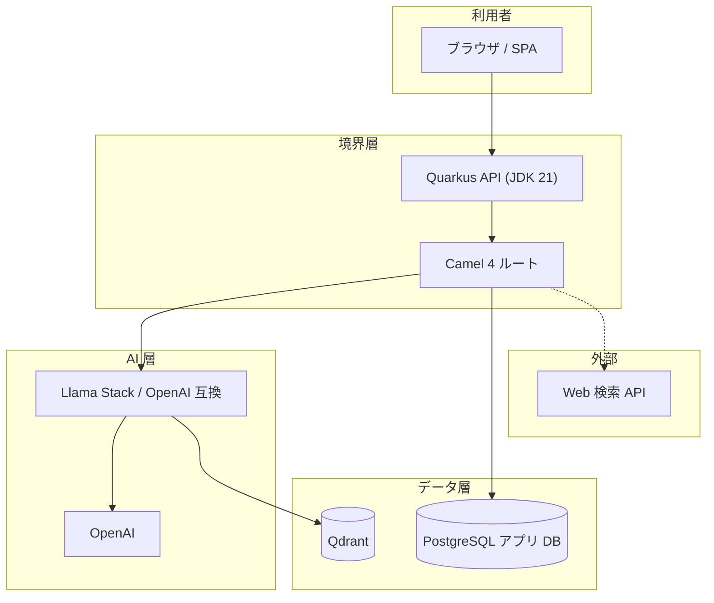

# 正法眼蔵プロジェクト — 構築設計書

**関連**: `doc/PLAN.md`（プロダクト方針） / `deploy/README.md`（起動手順）

---

## 1. 設計の目的

本書は、実装チームが**同一の境界・データ・API 契約**で開発できるように、システム分割・インタフェース・永続化・運用要件を固定する。プランの「何を作るか」に対し、本書は**どう組み立てるか**を定義する。

---

## 2. システムコンテキスト



**ローカル Compose 現状**: PostgreSQL（Llama Stack の KV / SQL メタ、`dogen_app`）と **Qdrant**（Llama Stack `remote::qdrant` の vector I/O）を別コンテナで起動する。本番では Postgres・Qdrant とも**論理分離**（別 Deployment / マネージドサービス）を推奨する。

---

## 3. コンポーネント責務

| コンポーネント | 責務 | 非責務（やらない） |
|----------------|------|---------------------|
| **フロント**（将来） | 表示・学習 UI・出典の可視化・免責表示 | API キー保持、生ログの長期保持 |
| **Quarkus** | REST 契約、認証・認可、入力検証、レート制限、DTO、トランザクション境界 | LLM プロンプトの細部組み立て（原則 Llama Stack 側） |
| **Camel** | Llama Stack / Web 検索 / 非同期通知の**統合**、タイムアウト・再試行・サーキットブレーカ、ペイロード変換 | ドメイン不変条件の唯一の置き場（Entity と REST で担保） |
| **Llama Stack** | RAG・vector store・ファイル検索・エージェントループ、OpenAI へのプロキシ | 課金ユーザのマスタ、授業ロールの権限モデル（アプリ DB で管理） |
| **アプリ DB** | 会話メタ、監査、フィードバック、（任意）自前チャンク索引メタ | Llama Stack 側のベクトル本体（**Qdrant**）の二重管理を避け、索引の単一責務は Llama Stack に寄せる |

---

## 4. リポジトリ構成（ターゲット）

実装時は次のディレクトリを追加する想定とする（未作成の場合は本書を正とする）。

```
dogen/
  doc/                 # 原典・PLAN・DESIGN（本書）
  deploy/              # Compose / OpenShift 雛形
  backend/             # Quarkus マルチモジュール（推奨）
    pom.xml            # 親 POM
    api/               # JAX-RS / SmallRye OpenAPI、CDI
    integration/       # Camel ルート、Llama Stack クライアント
    domain/            # 純粋ドメイン（任意）
    persistence/       # Panache / JDBC、Flyway
  tools/               # チャンク化・取り込み CLI（Python または Java）
  web/                 # 静的サイト（HTML/CSS/JS、`tools/gen_web_volumes.py` で巻スタブ生成）
```

モノリシック単一モジュールでもよいが、**API と Camel をパッケージ分離**することは必須とする。

---

## 5. Quarkus 設計

### 5.1 推奨拡張機能

- `quarkus-rest`（または `quarkus-resteasy-reactive` 系の現行標準）
- `quarkus-smallrye-openapi`
- `quarkus-hibernate-orm-panache` または `quarkus-jdbc-postgresql` + 手動リポジトリ
- `quarkus-flyway`
- `quarkus-arc`（CDI）
- `camel-quarkus-http` / `camel-quarkus-direct` / `camel-quarkus-microprofile-fault-tolerance`（要件に応じて）
- `quarkus-micrometer-registry-prometheus`（OpenShift でスクレイプ）

### 5.2 設定プロファイル

| プロファイル | 用途 |
|--------------|------|
| `dev` | ローカル、Llama Stack `http://localhost:8321` |
| `test` | テストコンテナ or WireMock |
| `prod` | OpenShift、Kubernetes Service 名で Llama Stack を参照 |

設定キー（案）:

- `llama-stack.base-url`（例: `http://dogen-llama-stack:8321`）
- `llama-stack.connect-timeout-ms` / `read-timeout-ms`
- `datasource.jdbc.url`（アプリ DB）

---

## 6. Apache Camel 4 設計

### 6.1 ルート方針

- **Inbound**: `direct:chatCompletion` のようなエンドポイントに Quarkus から委譲。
- **Outbound**:
  - `toD` / `http` で Llama Stack の `POST /v1/chat/completions` または Responses API（採用版に合わせ固定）。
  - 任意: `direct:webSearchEnrich` で検索 API → 本文をコンテキストに付与してから Llama Stack へ1 回の生成。
- **横断関心**: `onException` で 429/5xx のリトライ上限、`circuitBreaker` で Llama Stack 障害時のフェイルファスト。

### 6.2 Quarkus との接続

- REST リソースは **Camel ProducerTemplate** または **CDI で注入した RouteController** 経由で `direct:*` に送信し、**ブロッキング結果を Uni/CompletionStage にマップ**（SSE の場合は別ルート）。

---

## 7. REST API 契約（案）

バージョニング: `/api/v1` プレフィックス。

| メソッド | パス | 説明 |
|----------|------|------|
| `GET` | `/api/v1/health` | アプリ＋（任意）Llama Stack 疎通 |
| `POST` | `/api/v1/chat` | 問答。Body: `sessionId?`, `volumeScope?`, `messages[]` |
| `POST` | `/api/v1/feedback` | メッセージ ID に対する 👍/👎/コメント |

**`POST /api/v1/chat` リクエスト JSON（案）**

```json
{
  "sessionId": "uuid-optional",
  "volumeScope": "現成公案",
  "messages": [
    { "role": "user", "content": "…" }
  ]
}
```

**レスポンス（案）**: OpenAI Chat Completion 形式に近づけるか、独自 DTO で `citations` 配列（`chunkId`, `volume`, `excerpt` 等）を必須化する。

---

## 8. データモデル（アプリ DB）

Flyway で管理。初期案:

### 8.1 `chat_session`

| 列 | 型 | 説明 |
|----|-----|------|
| id | UUID PK | |
| created_at | timestamptz | |
| client_subject | varchar | 匿名化した利用者キー（任意） |
| volume_scope | varchar nullable | 巻スコープ |

### 8.2 `chat_message`

| 列 | 型 | 説明 |
|----|-----|------|
| id | UUID PK | |
| session_id | UUID FK | |
| role | varchar | user / assistant / system |
| content | text | ユーザー入力またはモデル出力要約 |
| raw_request_ref | varchar nullable | 外部ストレージの参照（全文を DB に載せない選択） |
| created_at | timestamptz | |

### 8.3 `audit_log`

| 列 | 型 | 説明 |
|----|-----|------|
| id | bigserial | |
| event | varchar | CHAT_REQUEST, LLAMA_STACK_ERROR, … |
| payload_json | jsonb | PII をマスクしたメタ |
| created_at | timestamptz | |

### 8.4 `user_feedback`

| 列 | 型 | 説明 |
|----|-----|------|
| id | UUID | |
| message_id | UUID FK | |
| rating | smallint | -1, 0, 1 等 |
| comment | text nullable | |

インデックス: `chat_message(session_id, created_at)`。

---

## 9. RAG / コーパス取り込み設計

### 9.1 チャンク仕様（論理）

- **単位**: 現代語訳の段落。漢文併記は同一チャンクの `metadata` に格納可。
- **必須メタデータ**: `corpus_version`, `volume_key`, `paragraph_index`, `source_attribution`（例: 中村訳）。
- **投入経路**:
  - **A**: Llama Stack の Files / Vector Store API にアップロード（運用を Llama Stack に寄せる）。
  - **B**: 自前 `corpus_chunk` テーブル + **Qdrant**（または当面 PostgreSQL の `float8[]` 等）+ 取り込みジョブ（Quarkus 外の `tools/`）。生成時は Camel が検索してから Llama Stack にコンテキスト注入。

フェーズ P0〜P1 は **A を優先**し、索引の単一責務を Llama Stack に置く。

### 9.2 品質ゲート

- 取り込み後のスモーク: 固定クエリ N 件で「出典メタが返る」ことを自動検証。

---

## 10. セキュリティ設計

- **秘密情報**: `OPENAI_API_KEY` は Llama Stack コンテナ（または OpenShift Secret）のみ。Quarkus は **Llama Stack へのネットワークアクセスのみ**（OpenAI 直叩きは必須ではない）。
- **CORS**: フロントオリジンをホワイトリスト。
- **レート制限**: IP または subject に対するトークン/リクエスト上限（アプリ DB または Redis 将来）。
- **ログ**: プロンプト全文を平文ログに出さない（ハッシュまたは長さのみ）。

---

## 11. 観測性

- **トレース**: `traceparent` をフロント → Quarkus → Camel HTTP ヘッダに伝播（Llama Stack が無視してもよい）。
- **メトリクス**: リクエスト数、レイテンシ、Llama Stack 5xx 率、トークン数（レスポンスヘッダから取得できる範囲）。

---

## 12. OpenShift マッピング

| 設計要素 | OpenShift リソース |
|----------|---------------------|
| Quarkus | `Deployment`, `Service`, `Route` |
| Llama Stack | `Deployment`, `ClusterIP Service`、**Route なし** |
| Postgres | `StatefulSet` またはマネージド DB 外部サービス |
| Qdrant | `StatefulSet` または Qdrant Cloud 等（Llama Stack からのみ到達） |
| 秘密 | `Secret`、SOPS/External Secrets 運用は組織標準に従う |
| 永続 | `PersistentVolumeClaim` |

ネットワークポリシー: **Namespace 内で Quarkus → Llama Stack:8321 のみ許可**。

---

## 13. 設計上の決定（ADR 要約）

| ID | 決定 | 理由 |
|----|------|------|
| D1 | RAG オーケストレーションは Llama Stack | プロバイダ差し替え・OpenAI 互換・vector 統合を集約 |
| D2 | 会話・監査はアプリ DB | 課題・教育データと AI ベンダ中立の監査を残す |
| D3 | Camel で外部 I/O | 再試行・変換をコードベースから分離しテストしやすくする |

---

## 14. 認証・学習進捗・検索強化（方針）

### 14.1 Keycloak とユーザ単位データ

**狙い** … チャットの `sessionId`（匿名 UUID）とは別に、**ログイン主体（`sub`）**を安定させ、クイズ正誤・学習ログ・フィードバックをユーザに紐づけて保存する。

**Keycloak を置く場合の利点** … オンプレ／K8s での IdP 統制、ロール・クライアント・ブローカーが揃い、Quarkus は `quarkus-oidc` で検証のみに専念できる。

**運用コスト** … レルム設計、TLS、バージョンアップ、セッション失効ポリシーは自前運用が重い。**小〜中規模**ではマネージド IdP（Auth0、Microsoft Entra ID、Okta 等）＋`quarkus-oidc` の方が早いことが多い。**大規模・複数クライアント**や既存 Keycloak 標準がある組織では Keycloak が合理的。

**段階提案** … **P0**: 現状の匿名＋ブラウザ内採点。**P1**: OIDC 導入（Keycloak またはマネージド）。**P2**: `quiz_attempt` 等のテーブルに `user_sub` を格納し API で集計（RLS やアプリ層で本人のみ閲覧）。

### 14.2 Vector DB 連携（回答品質）

第 9 章のとおり、**索引の単一責務は Llama Stack（Files / vector）に寄せる（D1）**のが優先。Quarkus/Camel は **検索メタの付与・出典ログ・フォールバック**に徹し、二重インデックスを避ける。

**Llama Stack の vector I/O** は **Qdrant**（`remote::qdrant`、環境変数 `QDRANT_URL` 等）を正とする（ローカル Compose では `deploy/local/compose.yaml` の `qdrant` サービス）。

**問答 API の簡易 RAG**（`RagService`）は現状、埋め込みベクトルをアプリ DB の `rag_chunk.embedding`（PostgreSQL `float8[]`）に保持しアプリ内でコサイン類似を計算している。スケールや運用統一のため Qdrant へ寄せる場合は、取り込みパスと検索実装の差し替えを別タスクで行う。

### 14.3 Web 検索連携

**Camel** で `direct:webSearchEnrich` のように **生成前に 1 回**検索 API（Tavily / Brave 等）を呼び、要約＋URL をプロンプトに注入する。必ず **引用の体裁** と **レート制限**、失敗時は検索なしで続行するフェイルソフトを設ける（第 6 章の例外方針と整合）。

---

## 15. 改訂履歴

| 日付 | 内容 |
|------|------|
| 2026-04-24 | 初版（構築設計・.cursor ルールの根拠） |
| 2026-04-24 | Mermaid 表記と API レスポンス案の文言を修正 |
| 2026-04-24 | `backend/` に Quarkus+Camel の問答 API（`/api/v1/chat`）を実装 |
| 2026-04-25 | 認証（Keycloak 案）・Vector／Web 検索の段階付けを §14 に追記 |
| 2026-04-26 | Vector DB を **Qdrant**（Llama Stack `remote::qdrant`）に変更。Compose・コンテキスト図を整合 |

